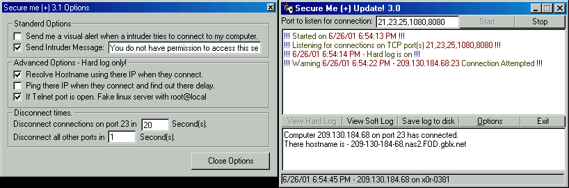



## Advanced Winsock And Parsing Secure me \+ 3\.1 UPDATE\! MORE OPTIONS\!

### Description

Almost completely rewritin. I have removed all the options off the main form and added a options section. in this update. Hard log is active. the abillity and options to ping and lookup there hostname when someone connects. 1 more spike, You can enable a fake linux telnet server. with root@local and see what kind of dirty things they try and do to you! =). if you like my program/code pls vote. Its greatly needing some apprecaition. Richedit 32 and Winsock is needed. Programmed in VisualBasic 6.0 Enterprise Edition.
 
### More Info
 

             |
---                |---
**Submitted On**   |2001-06-26 19:31:32
**By**             |[meth0s](https://github.com/Planet-Source-Code/PSCIndex/blob/master/ByAuthor/meth0s.md)
**Level**          |Advanced
**User Rating**    |4.6 (51 globes from 11 users)
**Compatibility**  |VB 4\.0 \(32\-bit\), VB 5\.0, VB 6\.0
**Category**       |[Internet/ HTML](https://github.com/Planet-Source-Code/PSCIndex/blob/master/ByCategory/internet-html__1-34.md)
**World**          |[Visual Basic](https://github.com/Planet-Source-Code/PSCIndex/blob/master/ByWorld/visual-basic.md)
**Archive File**   |[Advanced W217506262001\.zip](https://github.com/Planet-Source-Code/meth0s-advanced-winsock-and-parsing-secure-me-3-1-update-more-options__1-24471/archive/master.zip)

